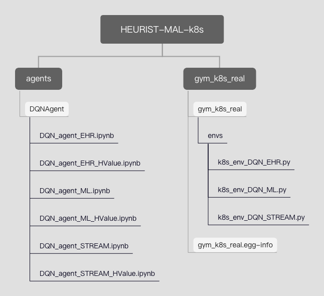

## HEURIST-MAL-k8s
## Folder Structure

#### agents folder
1. `DQN_agent_EHR.ipynb`: jupyter notebook for the pure deep Q-learning agent in the EHR use case;
2. `DQN_agent_EHR_HValue.ipynb`: jupyter notebook for the heuristic accelerated deep Q-learning agent in the EHR use case;
3. `DQN_agent_ML.ipynb`: jupyter notebook for the pure deep Q-learning agent in the ML use case;
4. `DQN_agent_ML_HValue.ipynb`: jupyter notebook for the heuristic accelerated deep Q-learning agent in the ML use case;
5. `DQN_agent_STREAM.ipynb`: jupyter notebook for the pure deep Q-learning agent in the STREAM use case;
6. `DQN_agent_STREAM_HValue.ipynb`: jupyter notebook for the heuristic accelerated deep Q-learning agent in the STREAM use case;

#### gym\_k8s\_real 
1. `gym_k8s_real`: 
2. the subfolder `envs` contains python files that define all properties or actions gym environments have; one python file correspond to one gym environment; 
3. the `k8s_env_DQN_EHR.py` file is the gym environment for deep Q-learning or heuristic accelerated deep Q-learning in the EHR use case;
4. the `k8s_env_DQN_ML.py` file is the gym environment for deep Q-learning or heuristic accelerated deep Q-learning in the ML use case;
5. the `k8s_env_DQN_STREAM.py` file is the gym environment for deep Q-learning or heuristic accelerated deep Q-learning in the STREAM use case;
2. `gym_k8s_real.egg-info`: generate automatically when you run `pip install gym_k8s_real` command to install this `gym_k8s_real` package;

## Pipeline of training
#### Prepare initial training enviroment
1. remove all deployments or svc of BF functions(encrypt, firewall);
2. deploy all proxy pods according to usecases: the deployment name should be proxy0, proxy1, proxy2, where name starts with zero;
3. make sure `gym_k8s_real` package is installed;

#### Start the training loop
1. start `DQN_agent_xxx.ipynb` or `DQN_agent_xxx_HValue.ipynb` jupyter notebook;
2. run all the cells in this notebook;
3. run the `train` function in the notebook, then it will automatically start training and recording.

#### Stages in the training loop

